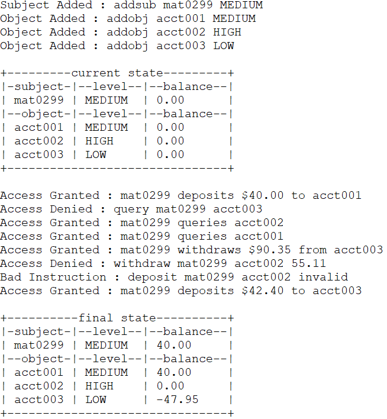

## Secure Banking System

This program implements a secure banking system based on the Biba integrity model.

### Description

The Biba integrity model is set of access control rules focused on data security.  
The goal of the model is to prevent the contamination high level entities from low level entities.  
Subjects and objects are ordered by integrity levels such as low, medium, and high.

Two central rules that this model follows are:

1. Integrity Star Property

	Write access focused, this rule can be thought of as "No write up" meaning subjects with lower integrity levels cannot modify objects with higher integrity levels.

2. Simple Integrity Condition

	Read access focused, this rule can be thought of as "No read down" meaning subjects with higher integrity levels cannot read objects with lower integrity levels.

This program receives input from a file containing commands such as:

- ADDSUB add subjects (people) to the baking system
- ADDOBJ add objects (accounts) to the banking system
- DEPOSIT enables a subject to deposit money into an object
- WITHDRAW enables a subject to withdraw money from an object
- QUERY enables a subject to read the balance of an object
- STATUS outputs all subjects and objects in the banking system

### Program Output

### Compile and Execute

- Windows:

	To compile run the command `g++ *.cpp -o bank`

	To execute run the command `bank.exe commands.txt`

- Linux / Mac:

	To compile run the command `g++ *.cpp -o bank`

	To execute run the command `./bank commands.txt`

### Function Headers

`void check_exe(int argc, char *argv[])`
- Description:

	Checks if program is executed with a file specified

- Parameters:

	`int argc` representing the number of arguments passed when executing the program

	`char *argv[]` an array of character pointers representing the arguments passed when executing the program

- Return:

	None

---

`int count_instructions(char *argv[])`
- Description:

	Counts number of instructions found in file when executed

- Parameters:

	`char *argv[]` an array of character pointers representing the arguments passed when executing the program

- Return:

	`int` representing the number of instructions in file

---

`vector<string> get_instructions(int num_instructions, char *argv[])`

- Description:

	Obtains all instructions in file specified upon executing

- Parameters:

	`int num_instructions` represents the number of instructions found in file

	`char *argv[]` an array of character pointers representing the arguments passed when executing the program

- Return:

	`vector<string>` represents the collection of instructions found in file

---

`vector<string> get_instruction_words(vector<string>& instructions)`

- Description:

	Parses each instruction word for word based on white spaces

- Parameters:

	`vector<string>& instructions` representing all instructions found in file

- Return:

	`vector<string>` holds each word from file

---

`bool check_format(vector<string> command)`

- Description:

	Evaluates each instruction for correct formatting, see comments for more details

- Parameters:

	`vector<string> command` collection of each word from file

- Return:

	`bool` True if instruction is in correct format, False if format is incorrect

---

`vector<struct instruction> make_objects(vector<string> instructions, int num_instructions)`

- Description:

	Initializes a struct with appropriate fields filled such as commands, subject names, object names, security levels, amount, and a boolean flag

- Parameters:

	`vector<string> instructions` representing all instructions found in file

	`int num_instruction` represents the number of instructions found in file

- Return:

	`vector<struct instruction>` collection of structs representing fields as described above

---

`void create_collection(Reference_monitor& monitor, vector<struct instruction> instruction_objects, int num_instructions)`

- Description:

	Initializes the class `Reference_monitor` with approperiate fields

- Parameters:

	`Reference_monitor& monitor` Controls the access to different objects and subjects

	`vector<struct instruction> instruction_objects` collection of structs representing fields previously initialized

	`int num_instructions` represents the number of instructions found in file

- Return:

	None

---

`void execute_commands(Reference_monitor& monitor, vector<struct instruction> instruction_objects, int num_instructions)`

- Description:

	Executes all commands on appropriate subjects and objects, dependent on their security level and the Biba integrity policy

- Parameters:

	`Reference_monitor& monitor` Controls the access to different objects and subjects

	`vector<struct instruction> instruction_objects` collection of structs representing fields previously initialized

	`int num_instructions` represents the number of instructions found in file

- Return:

	None

### Structures

`struct instruction`

- Description:

	Holds appropriate fields relevant to the command

- Variables:

	`string command` the command to be executed

	`string subject_name` the name of the subject

	`string object_name` the name of the object

	`string level` the security level of the subject or object

	`string amount` the amount to be deposited or withdrew

	`bool correct_format` true if instruction is in correct format, false otherwise

### Classes

`Bank_subject`

- Description:

	Represents the individuals (aka individuals) in the banking system

- Private member variables:

	`string name` name of the individual

	`float balance` represents the individuals account balance

- Public member functions:

	`Bank_subject(string name)` constructor initializing the individuals name with parameter `string name` and their account balance to 0.00

	`string get_name()` accessor to private member variable `string name`

	`float get_balance()` accessor to private member variable `float balance`

	`void set_balance(float amount)` mutator of private member variable `float balance`

---

`Bank_object`

- Description:

	Represents the objects (aka bank accounts) in the banking system

- Private member variables:

	`string name` name of the individual

	`float balance` represents the individuals account balance

- Public member functions:

	`Bank_object(string name)` constructor initializing the accounts name with parameter `string name` and its account balance to 0.00

	`string get_name()` accessor to private member variable `string name`

	`float get_balance()` accessor to private member variable `float balance`

	`void set_balance(float amount)` mutator of private member variable `float balance`

---

`Reference_monitor`

- Description:

	Access control enforcement function between subjects and objects

- Private member variables:

	`vector< pair<string, string> > subject_collection` collection of pairs representing (1) subjects and (2) their security levels

	`vector< pair<string, string> > object_collection` collection of pairs representing (1) objects and (2) thier security levels

	`vector<class Bank_subject> subject_balance` collection of Bank_subject classes

	`vector<class Bank_object> object_balance` collection of Bank_object classes

- Public member functions:

	`Reference_monitor()` Default constructor

	`void add_subject(class Bank_subject person, string level)` mutator of private member variable subject_collection

	`void add_object(class Bank_object acount, string level)` mutator of private member variable object_collection

	`vector< pair<string, string> > get_subjects()` accessor to private member variable subject_collection

	`vector< pair<string, string> > get_objects()` accessor to private member variable object_collection

	`vector<class Bank_subject> get_subject_balance()` accessor to private member variable subject_balance

	`vector<class Bank_object> get_object_balance()` accessor to private member variable object_balance

	`void print_status(string state)` outputs current commands being executed and state (current or final) of banking system

	`void exe_query(struct instruction instruction_objects)` performs query command of subjects on objects

	`void exe_deposit(struct instruction instruction_objects)` performs deposit command of subjects on objects

	`void exe_withdraw(struct instruction instruction_objects)` performs withdraw command of subjects on objects

### Other

`enum Security_levels`

Datatype representing the levels of security in the banking system being: Low, Medium, and High
